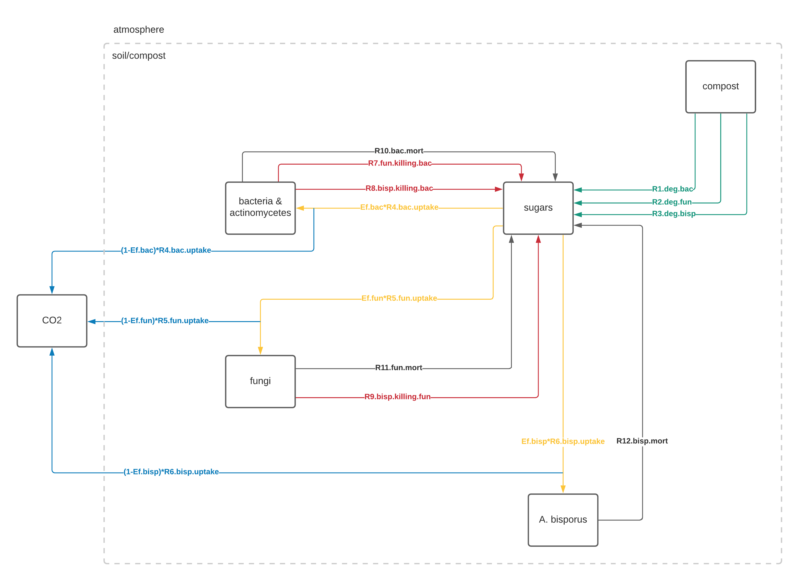
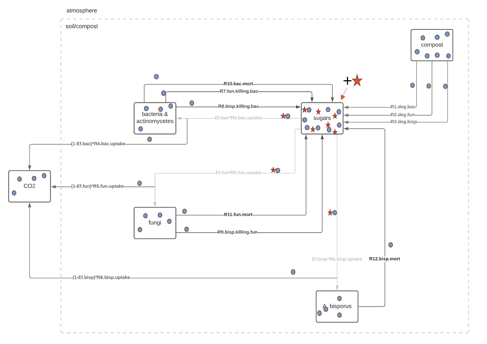
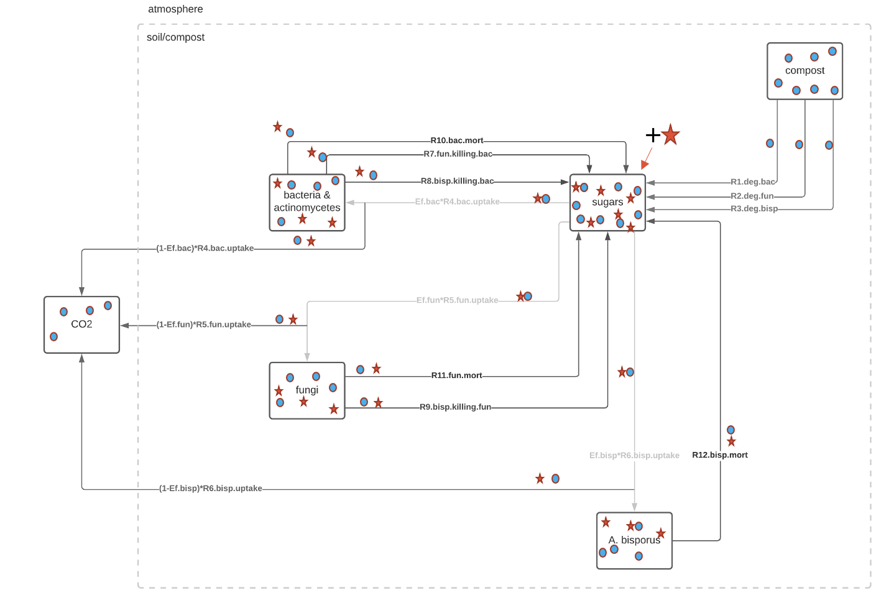

# compost-food-web
Mushroom compost food web modelling in R, supplemented by nematode analysis.

<h2> Natural abundance (carbon flow based) food web model </h2>

This is the most basic extant model for an "artificial" mushroom compost model. Artificial, due to the fact that it is a food web not commonly found in nature, but rather an achievement of dozens and hundreds of years of selective breeding and composting to achieve perfect conditions in which to raise _Agaricus bisporus_ to a commercially viable extent. 

As an artificial environment, specifically created to maximally propagate a single living organism, this food web is likewise truncated in comparison to any natural counterpart. The microbiota (pre-extant bacteria and fungi) is altered through processes of casing and aerating, changing the humidity and temperature and affecting entire generations and types of microbial fauna present. Likewise, some larger critters are not present (centipedes, mites, beetles, snails), as well as entire populations of common pests (aphids, flies). 

  

As such, the food web comes down to several factors: fungal populations, bacterial populations, _A. bisporus_ populations, nematode populations, recalcitrant sources of carbohydrates and lignin, readily available sources of broken down sugars, and carbon dioxide respired.

In its first functional form, the food web is modeled to exclude nematode populations, as they add an additional layer of higher trophic predatory complexity as both first and second level consumers. This documentation serves to both explain the model and serve as a repository of parameters. Some of the parameters are relied upon from (scarce) literature on the subject, while others are heavily inferred from a combination of literature sources or inferred from the outputs of the model itself. The table below serves to denote these sources and any comments on parameters found and their overall reliability.

<h2> 13C model addition </h2>

An extension of this basic model comes from labelling experiments, where labelled, or 13C carbon is added, as a one-off injection in the form of sugars, to the pool of what is otherwise predominantly naturally abundant 12C monosaccharide carbon. The surplus 13C starts to be uptaken by the living biomass in the compost.

  

As the time of the experiment progresses, surplus 13C accumulates in the biomass of the living organisms that uptake it. For the second trophic step, living organisms that eat other living organisms incorporate their biomass labelling, as well.

  

Finally, surplus 13C gets respired, incorporated and accumulates further in the biomass.

  

<h2> Natural abundance parameters and state variables </h2>

Parameter | Description | Unit | Value | Source(s) | Comments |
--- | --- | --- | --- |--- |--- |
Ef.bac | fraction of C assimilated by bacteria into their biomass as a result of metabolisation of sugars | (-) | 0.4 | Sinsabaugh, 2016. + Aanderud, 2018. | max. 30% is assimilated in biomass for soil dwellers, and is based on their C:N biomass ratio (around 8) / calibrated to 0.4 in the model
Ef.fun | fraction of C assimilated by fungi into their biomass as a result of metabolisation of sugars | (-) | 0.3 | Sinsabaugh, 2016. + Aanderud, 2018. | should be less than bacteria though, up to 10 times less
Ef.bisp | fraction of C assimilated by _A. bisporus_ into their biomass as a result of metabolisation of sugars | (-) | 0.016 - 0.3 | Krakowska, 2021., Sinsabaugh, 2016. + Aanderud, 2018. | calibrated to 0.4 in the model
kBISPORUS | Monod rate constant for _A. bisporus_ biomass | mmol C/g compost | 0.5 | calibrated |  
MAX.A.BISPORUS | maximum possible unlimited _A. bisporus_ biomass growth | mmol C/g compost | 1 | calibrated |
kSUGARS.bac | bacterial growth limitation due to sugars availability (C.INI * %) | mmol C/g compost | 0.1 - 0.4 | Vîtă, 2022. | check star conditions in Femke's thesis
kSUGARS.fun | fungal growth limitation due to sugars availability (C.INI * %) | mmol C/g compost | 0.1 - 0.4 | Vîtă, 2022. | check star conditions in Femke's thesis    
kSUGARS.bisp | _A. bisporus_ growth limitation due to sugars availability (C.INI * %) | mmol C/g compost | 0.1 - 0.4 | calibrated | expected similar to other fungi 
k1.deg.bac | degradation of recalcitrant materials from compost into sugars by bacteria | /d | 0.05 - 0.15 | Soares & Rousk, 2019. + Vîtă, 2022. | 
k2.deg.fun | degradation of recalcitrant materials from compost into sugars by fungi | /d | 0.05 - 0.15 | Soares & Rousk, 2019. + Vîtă, 2022. | fungi are expected to be better degraders than bacteria, in this context / calibrated to 0.2 in the model
k3.deg.bisp | degradation of recalcitrant materials from compost into sugars by _A. bisporus_ | /d | 0.075 - 0.13 | Andlar et al. 2018. | values found correspond to fungi whose active enzymes are incredibly similar in activity to _A. bisporus_, calibrated to 0.01 in the model
k4.bac.uptake | maximum uptake rate of carbohydrates by bacteria | /d | 0.04 - 0.1 | Bore et al. 2017. |
k5.fun.uptake | maximum uptake rate of carbohydrates by fungi | /d | 0.01 - 0.05 | Bore et al. 2017. |
k6.bisp.uptake | maximum uptake rate of carbohydrates by _A. bisporus_ | /d | 0.15 - 0.2 | calibrated | expected similar to other fungi
k7.fun.killing.bac | maximum predation rate constant for fungi predating on bacteria | /d | 0.1 - 0.2 | calibrated |
k8.bisp.killing.bac | maximum predation rate constant for _A. bisporus_ predating on bacteria | /d | 0.1 - 0.2 | calibrated |
k9.bisp.killing.fun | maximum predation rate constant for _A. bisporus_ predating on fungi | /d | 0.2 - 0.5 | calibrated |
k10.bac.mort | bacterial linear mortality rate constant | (mmol C/g compost)/d | 0.24 - 0.72 | Servais et al., 1985. | in water environments, calibrated to 0.1 |
k11.fun.mort | fungal linear mortality rate constant | (mmol C/g compost)/d | 0.01 - 0.1 | Lamour, 2002. | generally slower than bacteria |
k12.bisp.mort | _A. bisporus_ linear mortality rate constant | (mmol C/g compost)/d | 0 | Koch, 1958. | death under suitable growth conditions is uncommon, but calibrated to 0.01 in the model because it cannot be zero |

In addition, the system has starting state variables which are conditions that are in place the moment the model is ran. These most often refer to the amounts of biomass at the beginning of the run and are viewable in the table below.

State variable | Description | Unit | Value | Source(s) | Comments |
--- | --- | --- | --- |--- |--- |
BACTERIA | biomass of bacteria present at Phase III start | mmol C/g compost | 1.475 | Vos, 2017., Vîtă, 2022. | 1.4% - 2.2% of compost, 17.7 mg C/g compost
FUNGI | biomass of fungi (excluding _A. bisporus_) present at Phase III start | mmol C/g compost | 1.17 - 1.83 | Vos, 2017. | 1.77% of compost, 14 - 22 mg C/g compost, value of 1.6 used in model
A.BISPORUS | biomass of _A. bisporus_ present at Phase III start | mmol C/g compost | 0.008357 | Vos, 2017., Vîtă, 2022. | technically, _A. bisporus_ biomass is zero because only he inoculate on rye grain is present, not the mycelium, but value is calculated as 0.01% of compost
SUGARS | amount of sugars present at Phase III start as available monosaccharides | mmol C/g compost | 8.58222 | Jurak, 2013. | 26% of compost (w/w), gives 12 grams carbs in 45 grams compost
COMPOST | amount of total carbon present at Phase III start, mostly as undegraded polysaccharides | mmol C/g compost | 25 | Vîtă, 2022. | 30% carbon in 45 grams compost, gives 13.5 grams carbon
CO2 | amount of carbon dioxide present at Phase III start as a result of respiration | mmol C/g compost | 0 | Vîtă, 2022. |
C.INI | amount of total carbon present in the system at Phase III start | mmol C/g compost | 25 | Vîtă, 2022. | same value as compost, used for easier calculation only

<h2> 13C model addition parameters and state variables </h2>

In the 13C model addition, excess 13C calculated from PLFA extractions is multiplied with natural abundance state variables, which in turn gives 13C versions of state variables. The values for excess and corresponding state variables can be found in the following tables. Important to note - compost is not modelled in the 13C addition, as the labelling does not affect compost-related processes.

Excess parameter | Description | Unit | Value | Source(s) | Comments |
--- | --- | --- | --- |--- |--- |
e.bac | 13C excess in bacteria | mmol C/g compost | 0.001625 / 0.00239 | Vîtă, 2022. | first value calculated from bacterial PLFA biomarkers (1F) / second value calculated from bacterial PLFA biomarkers (Lucy)
e.fun | 13C excess in fungi | mmol C/g compost | 8.1e-5 / 8.03e-6 | Vîtă, 2022. | first value calculated from fungal PLFA biomarkers (1F) / second value calculated from fungal PLFA biomarkers (Lucy)
e.bisp | 13C excess in _A. bisporus_ | mmol C/g compost | 2.88e-9 | Vîtă, 2022. | calculated from fungal PLFA biomarkers (0.5F) uncharacteristically small value, e.fun value is used instead
e.sugars | 13C excess in sugars | mmol C/g compost | 0.011421 | Vîtă, 2022. | calculated from bulk carbon measurements
e.co2 | 13C excess in respired carbon dioxide | mmol C/g compost | 2.31e-7 | Vîtă, 2022. | calculated from carbon dioxide tests

13C state variable | Description | Unit | Value | Source(s) | Comments |
--- | --- | --- | --- |--- |--- |
BACTERIA.13C | incorporation of 13C label by bacteria | mmol C/g compost | 0.002396875 or 0.000352525 | Vîtă, 2022. | BACTERIA.13C = BACTERIA * e.bac
FUNGI.13C | incorporation of 13C label by fungi | mmol C/g compost | 0.0001296 or 0.000012848 | Vîtă, 2022. | FUNGI.13C = FUNGI * e.fun
A.BISPORUS.13C | incorporation of 13C label by _A. bisporus_ | mmol C/g compost | 2.406816e-11 | Vîtă, 2022. | A.BISPORUS.13C = A.BISPORUS * e.bisp
SUGARS.13C | 13C label effect on sugars | mmol C/g compost | 0.09801753 | Vîtă, 2022. | SUGARS.13C = SUGARS * e.sugars
CO2.13C | 13C label effect on total respiration | mmol C/g compost | 2.31e-12 | Vîtă, 2022. | CO2.13C = CO2 * e.co2

